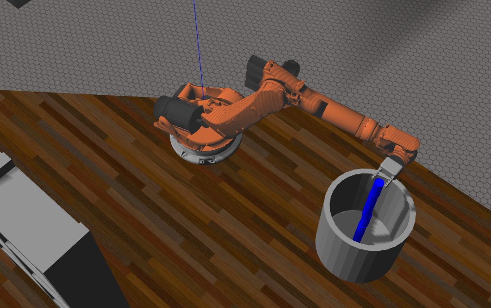

## Project: Kinematics Pick & Place
Welcome to the implementation of Autonomous Pick and Place operation!



---


**Steps to complete the project:**  


1. Set up your ROS Workspace.
2. Download or clone the [project repository](https://github.com/saurabdixit/RoboND-Kinematics-Project.git) into the ***src*** directory of your ROS Workspace.  
3. Perform catkin_make after cloning.
4. After catkin_make, Run following command:
```Shell
rosrun kuka_arm safe_spawnder.sh
```
...Note: The IK_Server.py will run automatically once you run above command. No need to run it separately! I have added the run command in the inveser_kinematics.launch.
...In code, I am checking whether the "demo" parameter value is set to TRUE or FALSE. Based on the value, I am making the decision whether to initiate the service or not
```python
def IK_server():
    # initialize node and declare calculate_ik service
    if rospy.get_param('/trajectory_sampler/demo'):
        print '-------------------------------------------------------------------------------'
        print 'Not starting IK Server as the /trajectory_sampler/demo parameter is set to TRUE'
        print '-------------------------------------------------------------------------------'
        pass
    else:
        print '-------------------------------------------------------------------------------'
        print '/trajectory_sampler/demo parameter is set to FALSE. Initiating IK Server-------'
        print '-------------------------------------------------------------------------------'
        rospy.init_node('IK_server')
        s = rospy.Service('calculate_ik', CalculateIK, handle_calculate_IK)
        print "Ready to receive an IK request"
        rospy.spin()
```
5. Once the environment is loaded, you can continue clicking next to see the result


[//]: # (Image References)

[image1]: ./misc_images/misc1.png
[image2]: ./misc_images/misc3.png
[image3]: ./misc_images/misc2.png

## [Rubric](https://review.udacity.com/#!/rubrics/972/view) Points
### Here I will consider the rubric points individually and describe how I addressed each point in my implementation.  

---
### Writeup / README

#### 1. Provide a Writeup / README that includes all the rubric points and how you addressed each one.  You can submit your writeup as markdown or pdf.  

You're reading it!

### Kinematic Analysis
#### 1. Run the forward_kinematics demo and evaluate the kr210.urdf.xacro file to perform kinematic analysis of Kuka KR210 robot and derive its DH parameters.

Here is an example of how to include an image in your writeup.

![alt text][image1]

#### 2. Using the DH parameter table you derived earlier, create individual transformation matrices about each joint. In addition, also generate a generalized homogeneous transform between base_link and gripper_link using only end-effector(gripper) pose.

Links | alpha(i-1) | a(i-1) | d(i-1) | theta(i)
--- | --- | --- | --- | ---
0->1 | 0 | 0 | L1 | qi
1->2 | - pi/2 | L2 | 0 | -pi/2 + q2
2->3 | 0 | 0 | 0 | 0
3->4 |  0 | 0 | 0 | 0
4->5 | 0 | 0 | 0 | 0
5->6 | 0 | 0 | 0 | 0
6->EE | 0 | 0 | 0 | 0


#### 3. Decouple Inverse Kinematics problem into Inverse Position Kinematics and inverse Orientation Kinematics; doing so derive the equations to calculate all individual joint angles.

And here's where you can draw out and show your math for the derivation of your theta angles. 

![alt text][image2]

### Project Implementation

#### 1. Fill in the `IK_server.py` file with properly commented python code for calculating Inverse Kinematics based on previously performed Kinematic Analysis. Your code must guide the robot to successfully complete 8/10 pick and place cycles. Briefly discuss the code you implemented and your results. 


Here I'll talk about the code, what techniques I used, what worked and why, where the implementation might fail and how I might improve it if I were going to pursue this project further.  


And just for fun, another example image:
![alt text][image3]


